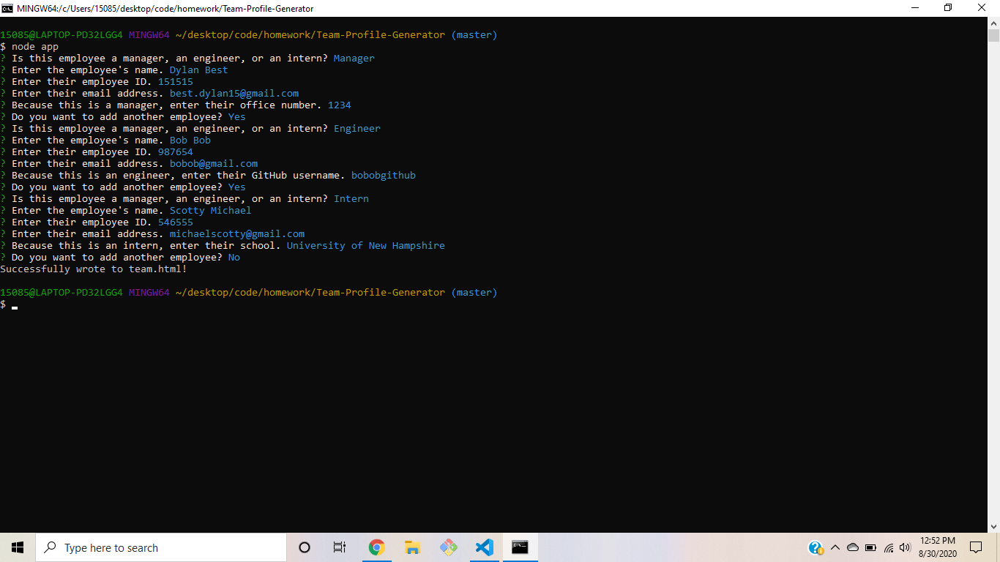
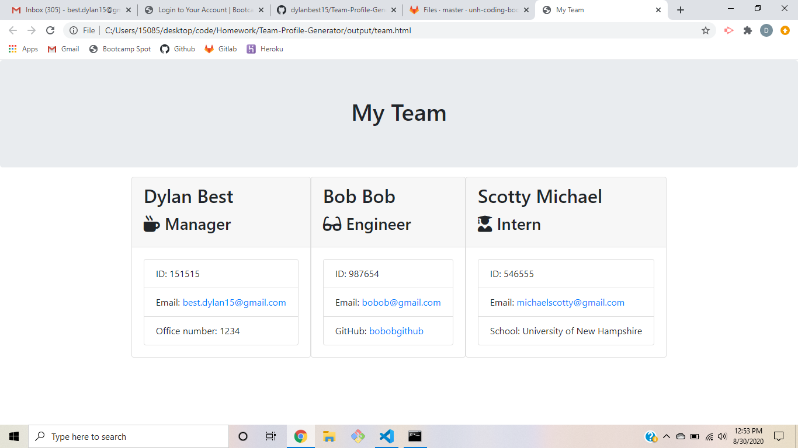

# Team-Profile-Generator
This application will generate a team profile for the user utilizing Node.js and Inquirer NPM prompts. The user can run the app on and follow the prompts to enter their team which can include any number of Managers, Engineers, and Interns. The app will then write to the team.html file and create a website to showcase the team profile which will inlude each member's name, employee id, and email. It will also include the office number for managers, the github username for engineers, and the school for interns.

## Built With
- <a href="https://getbootstrap.com/">Bootstrap</a>
- <a href="https://www.npmjs.com/package/inquirer">Inquirer NPM</a>
- <a href="https://www.npmjs.com/package/jest">Jest NPM</a>

## Screenshots

## License
Copyright ©2020 Dylan Best

Permission is hereby granted, free of charge, to any person obtaining a copy of this software and associated documentation files (the "Software"), to deal in the Software without restriction, including without limitation the rights to use, copy, modify, merge, publish, distribute, sublicense, and/or sell copies of the Software, and to permit persons to whom the Software is furnished to do so, subject to the following conditions:

The above copyright notice and this permission notice shall be included in all copies or substantial portions of the Software.

THE SOFTWARE IS PROVIDED "AS IS", WITHOUT WARRANTY OF ANY KIND, EXPRESS OR IMPLIED, INCLUDING BUT NOT LIMITED TO THE WARRANTIES OF MERCHANTABILITY, FITNESS FOR A PARTICULAR PURPOSE AND NONINFRINGEMENT. IN NO EVENT SHALL THE AUTHORS OR COPYRIGHT HOLDERS BE LIABLE FOR ANY CLAIM, DAMAGES OR OTHER LIABILITY, WHETHER IN AN ACTION OF CONTRACT, TORT OR OTHERWISE, ARISING FROM, OUT OF OR IN CONNECTION WITH THE SOFTWARE OR THE USE OR OTHER DEALINGS IN THE SOFTWARE.

## Tests
This application includes four tests using Jest NPM in order to test to the constructor classes for the Employee object, and extended Engineer, Intern, and Manager objects.

## Authors
- **Dylan Best** - [dylanbest15](https://github.com/dylanbest15)